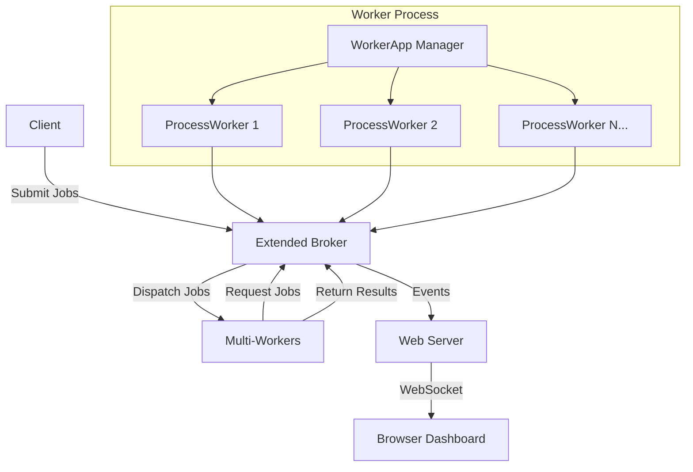

# Dashboard Example Architecture

This document explains the architecture of the BreezeQ dashboard example and how the files work together.

## File Structure

```
src/examples/with_dash_ui/
├── README.md                     # Main documentation
├── ARCHITECTURE.md               # This file
├── package.json                  # Dependencies and scripts
├── .env.example                  # Environment configuration example
├── start.sh                      # Startup script
├── dashboard.html                # Real-time dashboard UI
│
├── Core Components/
│   ├── extended_broker.ts        # Enhanced broker with events
│   ├── web_server.ts             # uWebSockets.js web server
│   ├── broker_with_dashboard.ts  # Main broker application
│   └── client.ts                 # Client for job submission
│
├── Worker System/
│   └── workers.ts                # Multi-worker application (multiple JQP workers in same process)
│
└── Process Management/
    └── run_all.ts                # Process orchestrator
```

## Component Architecture

### 1. Extended Broker (`extended_broker.ts`)
- Extends the base `JQPBroker` class
- Adds event emission for real-time monitoring
- Tracks statistics (workers, jobs, uptime)
- Uses `EventEmitter` to notify web server of changes

### 2. Web Server (`web_server.ts`)
- Built with `uWebSockets.js` for high performance
- Serves the dashboard HTML file
- Provides REST API for current statistics
- Manages WebSocket connections for real-time updates
- Listens to broker events and broadcasts to clients

### 3. Dashboard (`dashboard.html`)
- Single HTML file with embedded CSS and JavaScript
- Uses Tailwind CSS for styling
- Plain JavaScript (no build tools required)
- WebSocket client for real-time updates
- Responsive design with live statistics and activity log

### 4. Multi-Worker System (`workers.ts`)

The worker system runs multiple `JQPWorker` instances in the same process for efficiency and simplicity:

#### ProcessWorker Class
- Extends `JQPWorker` for job processing
- Each worker instance handles one job type (math, data-processing, image-resize)
- Implements custom job processors for different job types

#### WorkerApp Class
- Manages multiple ProcessWorker instances in the same process
- Configurable worker count via environment variables
- Handles worker lifecycle (start, stop, graceful shutdown)
- No inter-process communication overhead

#### Built-in Job Processors
- **Math**: add, multiply, fibonacci, factorial operations
- **Data Processing**: sort, filter, transform, aggregate operations  
- **Image Processing**: simulated image resize operations

### 5. Process Management

#### ProcessOrchestrator (`run_all.ts`)
- Manages all processes (broker, workers, client)
- Colored logging for each process
- Auto-restart on failure
- Graceful shutdown handling

## Data Flow



## Event Flow

1. **Job Submission**: Client submits job → Broker queues job → Event emitted
2. **Worker Registration**: Worker connects → Broker registers → Event emitted  
3. **Job Dispatch**: Broker sends job to worker → Event emitted
4. **Job Completion**: Worker completes job → Broker updates → Event emitted
5. **Real-time Updates**: Broker events → WebServer → WebSocket → Dashboard

## Configuration

All components are configurable via environment variables:

- **Ports**: Frontend (5555), Backend (5556), Web (3000)
- **Worker Count**: Default 3, configurable per job type
- **Job Types**: math, data-processing, image-resize
- **Submission Rate**: Configurable job submission interval

## Process Communication

### Between Processes
- **ZeroMQ**: Broker ↔ Workers, Broker ↔ Clients
- **WebSocket**: WebServer ↔ Browser Dashboard
- **HTTP**: REST API for initial data

### Within Process
- **EventEmitter**: Broker → WebServer notifications
- **Direct Method Calls**: WorkerApp → ProcessWorker instances communication

## Error Handling

- **Worker Failure**: Auto-restart with exponential backoff
- **Connection Loss**: Client/Worker reconnection logic
- **WebSocket Failure**: Browser auto-reconnection
- **Process Crash**: Process manager restart functionality

## Scalability Features

- **Configurable Worker Count**: Scale workers per job type within the same process
- **Multi-process Architecture**: Each component can run separately (broker, workers, client)
- **Event-driven Updates**: Efficient real-time notifications
- **Memory-based Persistence**: Fast in-memory job storage
- **Simple Deployment**: No worker thread complexity, easy to understand and debug

This architecture provides a robust, scalable job queue system with comprehensive monitoring capabilities while keeping the implementation simple and maintainable.
